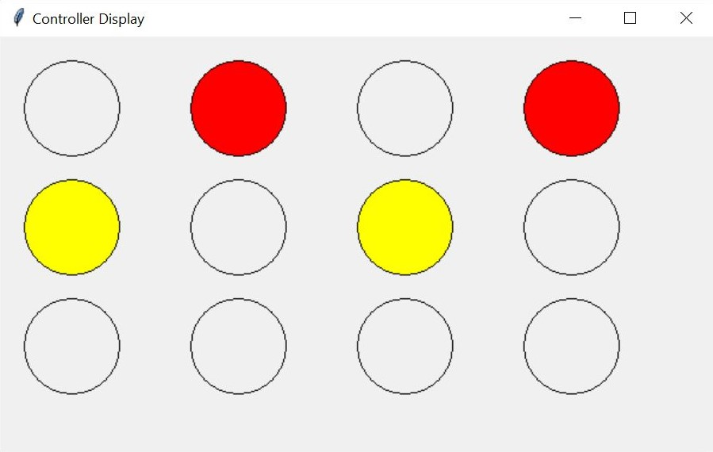

# Traffic-Light-Controller-with-GUI

## Objectives:
1. Understand the differences between the syntax of a Python application and a ROS module.
2. Complete a Python/ROS project.

## Instructions:
Generate a traffic light controller capable of organizing 4 traffic lights. You are only allowed to work with Python and/or ROS.

## Options:
|# |Hardware                                     |Software       |Requirements                                                                         |
|:-|:--------------------------------------------|:--------------|:------------------------------------------------------------------------------------|
|1 |Resistors, LEDs, Raspberry Pi, Jumper Cables |Python         |Design program and implement circuit on breadboard and connect it to the Raspberry Pi|
|2 |None                                         |Python         |Design program and and GUI (Graphic User Interface)                                  |
|3 |Resistors, LEDs, Raspberry Pi, Jumper Cables |Python and ROS |Design program and implement circuit on breadboard and connect it to the Raspberry Pi|
|4 |None                                         |Python and ROS |Log data on the terminal (Keep it simple)                                            |

## Expected Time:
3 weeks

## Sample solution:
The file TrafficLightController.py file contains the solution for the second option for this challenge.

It required the use of the following packages and modules:
1. TKinter -> GUI
2. Time -> sleep function
2. Logging -> For error messages

It contains two classes:
|Class                     |Description                                                                                                   |
|:-------------------------|:-------------------------------------------------------------------------------------------------------------|
|TrafficLight()            |Contains basic functionality for the traffic lights                                                           |
|TrafficLightController()  |Determines the characteristics of the controller, such as number of traffic lights, state information, and GUI|
1. TrafficLight() -> This class 
2. TrafficLightController() -> This class determines the characteristics of the controller as well as its GUI

